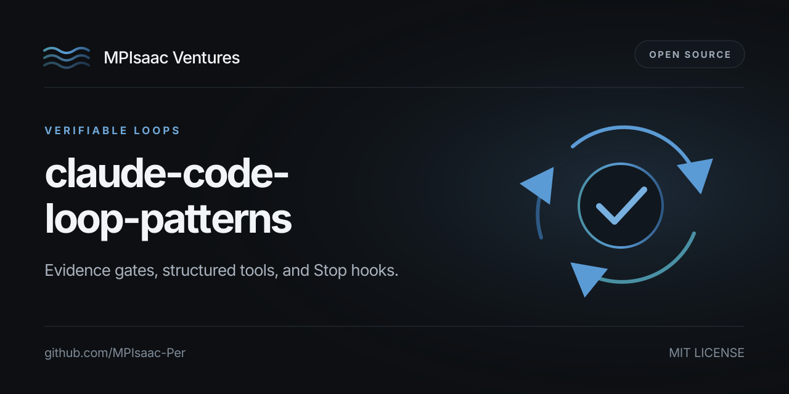

# Claude Code loop patterns



[](https://github.com/MPIsaac-Per/claude-code-loop-patterns/actions/workflows/ci.yml)
[](https://github.com/MPIsaac-Per/claude-code-loop-patterns/actions/workflows/codeql.yml)
[](https://scorecard.dev/viewer/?uri=github.com/MPIsaac-Per/claude-code-loop-patterns)
[](LICENSE)

Companion code for **What I Learned From 245,306 Claude Code Tool Calls**.

The article treats Claude Code as an operating loop. This repository provides small, tested primitives for structured command output, test reporting, verification evidence, Stop-hook enforcement, and prompt-cache assembly. Copy a folder into a project or use the implementations as references.

## Code samples

| Folder | Pattern | Article section |
|---|---|---|
| [`01-structured-shell/`](./01-structured-shell) | A shell wrapper that emits structured success/failure with file:line citations and diagnostic hints. | §1, §5 |
| [`02-structured-tests/`](./02-structured-tests) | A pytest plugin that emits one JSONL line per test, with structured failure data. | §5 |
| [`03-verification-gate/`](./03-verification-gate) | A verification harness that runs gates and writes evidence files for downstream "done" enforcement. | §10, §11 |
| [`04-stop-hook/`](./04-stop-hook) | A Claude Code Stop hook that blocks completion when no recent verification evidence exists. | §10 |
| [`05-prompt-cache/`](./05-prompt-cache) | A prompt builder that keeps the cacheable prefix byte-stable and isolates dynamic content. | §8 |

## Skills

The [`skills/`](./skills) directory ships three Claude Code skills that codify the loop rules so the agent invokes them on the right turn:

| Skill | When it fires |
|---|---|
| [`verify-before-done`](./skills/verify-before-done) | About to declare a task complete (§10) |
| [`read-before-edit`](./skills/read-before-edit) | About to edit a file you have not read (§3) |
| [`loop-failure-triage`](./skills/loop-failure-triage) | A tool call just failed (§5) |

## Run

Each runtime sample is self-contained and uses the Python standard library. Development requires Python 3.11+ and [uv](https://docs.astral.sh/uv/).

```bash
git clone https://github.com/MPIsaac-Per/claude-code-loop-patterns
cd claude-code-loop-patterns
python3 01-structured-shell/run_loud.py --tag test pytest -q
```

Run the repository checks:

```bash
uv sync --locked --dev
uv run ruff check .
uv run ruff format --check .
uv run pytest --cov=. --cov-report=term-missing
```

## Origins and scope

Most of these patterns have prior art. The contribution of this repo is the composition: a small set of primitives that compose into a verifiable, auditable agent loop without any framework.

- **Repository-specific composition**: the Stop-hook and evidence-file integration in `04-stop-hook`, plus the three loop-discipline skills under `skills/`.
- **Reference implementations**: `run_loud.py`, the pytest JSONL reporter, and the prompt-cache builder adapt established patterns to agent loops.
- **Current contract references**: [Claude Code hooks](https://code.claude.com/docs/en/hooks), [Claude Code skills](https://code.claude.com/docs/en/skills), and [Anthropic prompt caching](https://platform.claude.com/docs/en/build-with-claude/prompt-caching).

## Open-source research collection

This repository is one part of Michael Isaac's public agent engineering collection:

- [claude-code-ops-audit](https://github.com/MPIsaac-Per/claude-code-ops-audit), audit methods and DuckDB analysis
- [agentinfra-examples](https://github.com/MPIsaac-Per/agentinfra-examples), infrastructure and observability examples
- [mpiv.ai open-source research](https://mpiv.ai/#code), the collection index

See [CONTRIBUTING.md](CONTRIBUTING.md) for development and contribution instructions and [SECURITY.md](SECURITY.md) for private vulnerability reporting.

## License

MIT.
